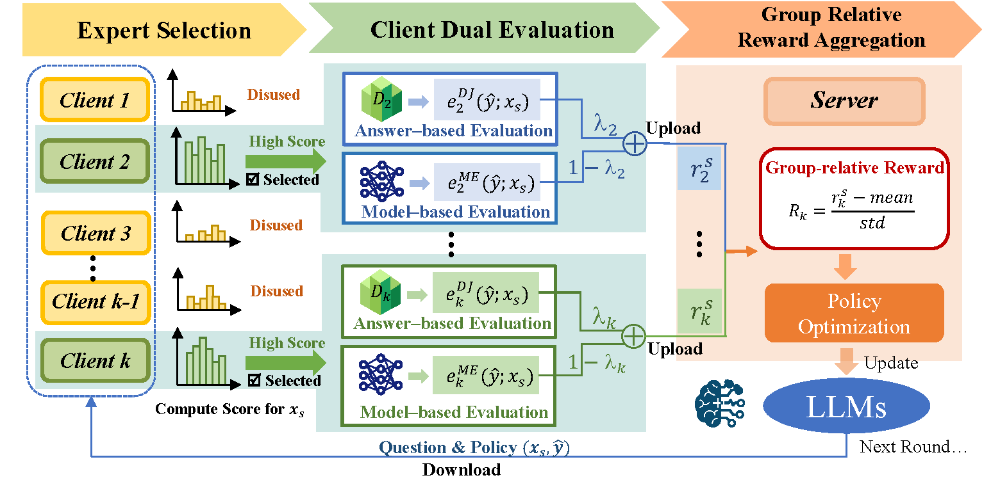

# FedGRPO: Privately Optimizing Foundation Models with Group-Relative Rewards from Domain Clients

This is the official pytorch implementation of the paper: **FedGRPO: Privately Optimizing Foundation Models with Group-Relative Rewards from Domain Clients**, which has been **accepted by AAAI 2026 Main Track as oral presentation**.

**Abstract:** One important direction of Federated Foundation Models (FedFMs) is leveraging data from small client models to enhance the performance of a large server‑side foundation model. Existing methods based on model level or representation level knowledge transfer either require expensive local training or incur high communication costs and introduce unavoidable privacy risks. We reformulate this problem as a reinforcement learning style evaluation process and propose FedGRPO, a privacy preserving framework comprising two modules. The first module performs competence-based expert selection by building a lightweight confidence graph from auxiliary data to identify the most suitable clients for each question. The second module leverages the “Group Relative” concept from the Group Relative Policy Optimization (GRPO) framework by packaging each question together with its solution rationale into candidate policies, dispatching these policies to a selected subset of expert clients, and aggregating solely the resulting scalar reward signals via a federated group–relative loss function. By exchanging reward values instead of data or model updates, FedGRPO reduces privacy risk and communication overhead while enabling parallel evaluation across heterogeneous devices. Empirical results on diverse domain tasks demonstrate that FedGRPO achieves superior downstream accuracy and communication efficiency compared to conventional FedFMs baselines.



---

## 🔧 Environment Setup

- **Base Project**: [trl](https://github.com/huggingface/trl) and [open-r1](https://github.com/huggingface/open-r1) of Huggingface.
- **Core Dependencies**:
  - [`vLLM`](https://github.com/vllm-project/vllm)
  - [`flash-attention`](https://github.com/Dao-AILab/flash-attention)

Make sure you have a compatible GPU setup and install necessary dependencies for `vllm` and `flash-attention`.

---


##  Reward Functions

The project supports a flexible reward design tailored to different tasks:

- `accuracy_reward`: Measures answer correctness.
- `format_reward` *(Optional)*: Encourages structured or step-by-step reasoning.
- `tag_count_reward` *(Optional)*: Rewards increased thought-chain steps.
- `len_reward` *(Optional)*: Penalizes overly long outputs; aligns with Kimi's concise-answer philosophy.
- `QA_reward`: Specialized accuracy reward for QA tasks.
- `code_reward`: Specialized accuracy reward for programming/code generation tasks.

------

## ⚙️ Training Configuration Tips

To avoid OOM (Out-Of-Memory) issues, optimize training configuration based on your hardware setup.

### Key Parameters

- `per_device_train_batch_size`: Recommended 1 or 2.
- `gradient_accumulation_steps`: Recommended 6 or 12.
- `batch_size = num_gpus * per_device_train_batch_size * gradient_accumulation_steps`
- `max_completion_length`: Affects both performance and memory usage.

## 🚀 Quick Start

```shell
# Before Training:
CUDA_VISIBLE_DEVICES={your_gpu_index} trl vllm-serve --model \
 path_to/Qwen2.5-3B --gpu_memory_utilization 0.85

# For FedGRPO
bash train_fedgrpo_3B.sh
# For Central GRPO
bash train_grpo_3B.sh
```


## 🙌 Acknowledgements

- [Huggingface open-r1](https://github.com/huggingface/open-r1)
- [vLLM](https://github.com/vllm-project/vllm)
- [FlashAttention](https://github.com/Dao-AILab/flash-attention)
